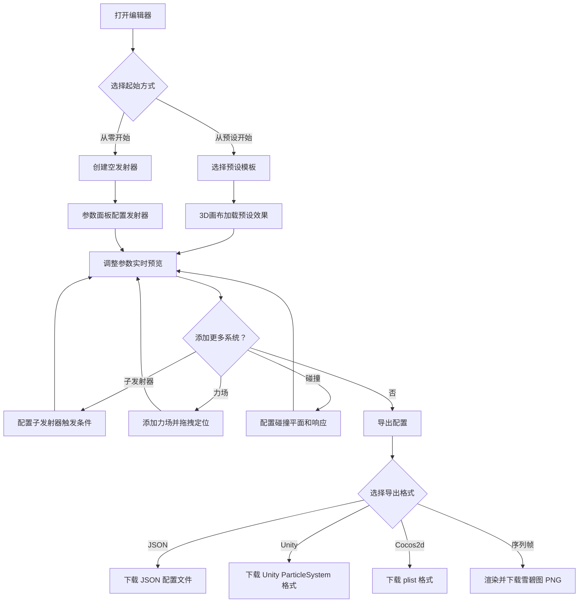

## 1. 产品概述

粒子特效编辑器（Particle FX Editor）是一款运行在浏览器内的专业级粒子系统可视化编辑工具，面向游戏设计师和特效艺术家。用户通过参数面板实时调节粒子发射器、生命周期属性、纹理、力场、碰撞等配置，在 WebGL 画布中即时预览效果，最终导出为 JSON / Unity / Cocos2d / 序列帧 PNG 等格式供游戏引擎使用。

核心价值：将粒子特效的"调参-预览-导出"工作流从游戏引擎编辑器中解放出来，实现零安装、跨平台、实时反馈的专业级编辑体验。

## 2. 核心功能

### 2.1 功能模块

1. **编辑器主界面**：3D 预览画布 + 左侧发射器列表 + 右侧参数面板 + 底部时间轴控制栏
2. **粒子发射器配置**：形状（点/圆/矩形/球面/锥体）、发射速率、爆发模式、持续时间与循环
3. **粒子生命周期属性**：生命周期、速度、加速度、颜色渐变、大小变化、透明度变化、旋转速度
4. **曲线编辑器**：贝塞尔曲线关键帧编辑，支持线性/平滑/阶梯插值
5. **纹理系统**：自定义贴图上传、内置形状、精灵图集序列帧、混合模式、朝向模式
6. **子发射器**：Birth/Death/Lifecycle 百分比触发，最多嵌套 2 层
7. **力场系统**：引力场、斥力场、湍流场、方向力场，可拖拽定位
8. **碰撞响应**：无限平面碰撞，弹跳/摩擦/生命衰减/碰撞消亡
9. **预设库**：火焰/烟雾/爆炸/雨/雪/魔法光效/火花/瀑布水流
10. **导出功能**：JSON / Unity / Cocos2d / 序列帧雪碧图 PNG

### 2.2 页面详情

| 页面名称 | 模块名称 | 功能描述 |
|---------|---------|---------|
| 编辑器主页面 | 3D 预览画布 | WebGL 渲染粒子效果，3D 摄像机操控（旋转/缩放/平移），背景切换，FPS 和粒子数显示 |
| 编辑器主页面 | 发射器列表面板 | 左侧折叠面板，管理场景中多个发射器，支持增删复制排序 |
| 编辑器主页面 | 参数配置面板 | 右侧折叠面板，分区展示当前选中发射器的所有参数，内嵌曲线编辑器和渐变编辑器 |
| 编辑器主页面 | 时间轴控制栏 | 底部播放控制（播放/暂停/重置），时间进度条 |
| 编辑器主页面 | 预设选择面板 | 弹出式面板，展示内置预设缩略图，点击加载 |
| 编辑器主页面 | 导出面板 | 弹出式面板，选择导出格式和参数，触发下载 |

## 3. 核心流程

用户打开编辑器后，默认显示一个空白 3D 画布。用户可以从预设库选择一个模板快速开始，也可以手动创建发射器。在参数面板中调节各项属性时，3D 画布实时更新粒子效果。满意后通过导出面板选择目标格式下载配置文件。

## 4. 用户界面设计

### 4.1 设计风格

- **主色调**：深色工业风 — 深灰 (#1a1a2e) 为底，霓虹青 (#00f0ff) 为强调色，暗橙 (#ff6b35) 为警告/活跃色
- **次要色**：中灰 (#2d2d44) 用于面板背景，亮灰 (#e0e0e0) 用于文字
- **按钮风格**：扁平圆角，hover 时轻微上浮 + 发光边框
- **字体**：JetBrains Mono 用于数值显示，Outfit 用于界面文字
- **布局**：三栏式专业编辑器布局 — 左侧发射器树、中央画布、右侧参数面板
- **图标**：lucide-react 图标库
- **视觉风格**：游戏引擎编辑器风格，类似 Unity/Unreal 的暗色主题，但更现代简洁

### 4.2 页面设计概览

| 页面名称 | 模块名称 | UI 元素 |
|---------|---------|---------|
| 编辑器主页面 | 3D 预览画布 | 深色背景全屏画布，左上角 FPS/粒子数 HUD，右上角背景切换按钮组 |
| 编辑器主页面 | 发射器列表面板 | 左侧 240px 折叠面板，发射器卡片列表，底部"添加发射器"按钮 |
| 编辑器主页面 | 参数配置面板 | 右侧 320px 可滚动面板，可折叠分区（发射/生命周期/纹理/子发射器/力场/碰撞），内嵌曲线编辑器和渐变条 |
| 编辑器主页面 | 时间轴控制栏 | 底部 48px 栏，播放/暂停/重置图标按钮，进度条，循环开关 |
| 编辑器主页面 | 预设选择面板 | 居中弹窗，2x4 网格展示预设缩略图卡片，hover 显示名称和描述 |
| 编辑器主页面 | 导出面板 | 居中弹窗，格式选择单选按钮组，参数输入框，导出按钮 |

### 4.3 响应式设计

- 桌面优先设计，最小支持 1280px 宽度
- 左右面板可折叠收起以扩大画布区域
- 参数面板内容区域可滚动，分区可折叠

### 4.4 3D 场景指引

- **环境**：纯黑/纯白/棋盘格背景可切换，无环境光照依赖
- **摄像机**：透视相机，初始位置 (0, 2, 8)，lookAt 原点，支持轨道控制器旋转/缩放/平移
- **粒子渲染**：自定义 GLSL 着色器，支持 Additive/Alpha Blend/Multiply 混合模式，Billboard 朝向
- **辅助可视化**：发射器形状线框、力场线框球体/箭头、碰撞平面半透明网格
- **性能目标**：10000 粒子 @ 60FPS，GPU 实例化渲染 + TypedArray + 对象池
