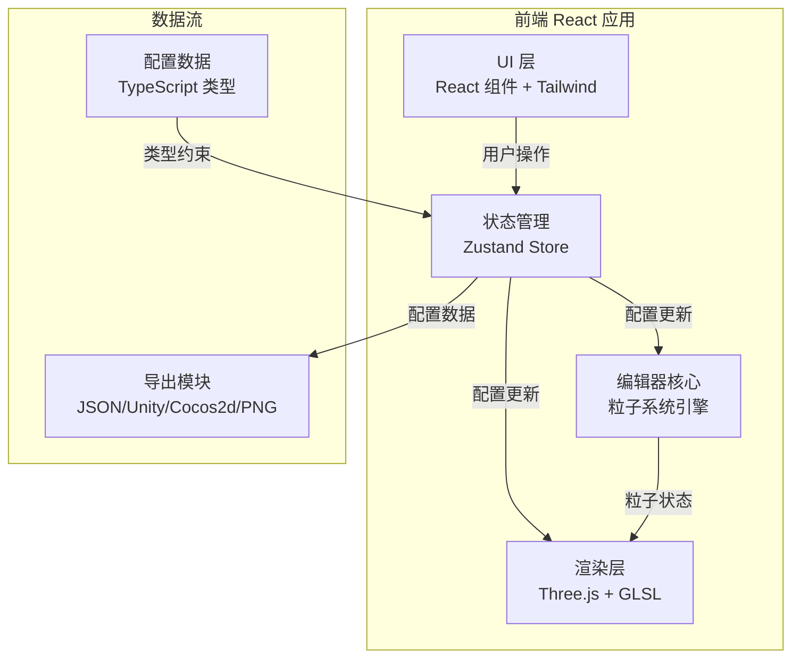
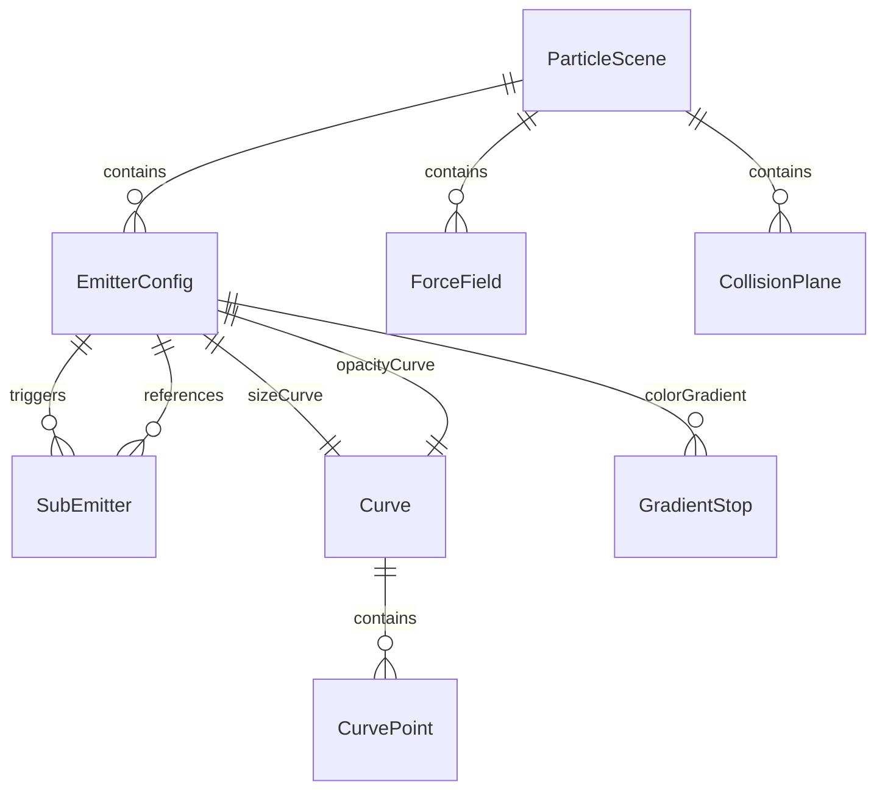

## 1. 架构设计



## 2. 技术说明

- **前端框架**：React@18 + TypeScript + Tailwind CSS@3
- **构建工具**：Vite@6
- **3D 渲染**：Three.js@0.184 + 自定义 GLSL 着色器
- **状态管理**：Zustand@5
- **图标**：lucide-react
- **无后端**：纯前端应用，所有计算在浏览器完成
- **部署**：node:20-alpine 构建 → nginx:alpine 托管

## 3. 路由定义

| 路由 | 用途 |
|------|------|
| `/` | 编辑器主页面（唯一页面，所有功能在同一页面内） |

## 4. 核心数据模型

### 4.1 类型定义

```typescript
type EmitterShape = 'point' | 'circle' | 'rectangle' | 'sphere' | 'cone'
type BlendMode = 'additive' | 'alpha' | 'multiply'
type OrientationMode = 'billboard' | 'horizontal' | 'velocity'
type CurveType = 'linear' | 'smooth' | 'step'
type SubEmitterEvent = 'birth' | 'death' | 'lifecycle'
type FieldType = 'gravity' | 'repulsion' | 'turbulence' | 'directional'
type CollisionResponse = 'bounce' | 'decay' | 'kill'

interface CurvePoint {
  time: number
  value: number
  inHandle?: [number, number]
  outHandle?: [number, number]
}

interface Curve {
  type: CurveType
  points: CurvePoint[]
}

interface GradientStop {
  time: number
  color: [number, number, number]
  alpha: number
}

interface EmitterConfig {
  id: string
  name: string
  shape: EmitterShape
  shapeParams: Record<string, number>
  emissionRate: number
  burstMode: boolean
  burstCount: number
  duration: number
  looping: boolean
  lifetime: [number, number]
  initialSpeed: [number, number]
  direction: 'normal' | 'fixed'
  fixedDirection: [number, number, number]
  acceleration: [number, number, number]
  colorGradient: GradientStop[]
  sizeCurve: Curve
  opacityCurve: Curve
  rotationSpeed: [number, number]
  texture: string | null
  builtInShape: 'softCircle' | 'square' | 'star' | 'smoke' | null
  spriteSheet: { rows: number; cols: number } | null
  blendMode: BlendMode
  orientation: OrientationMode
  subEmitters: { event: SubEmitterEvent; lifecyclePercent?: number; emitter: EmitterConfig }[]
  position: [number, number, number]
  rotation: [number, number, number]
}

interface ForceField {
  id: string
  type: FieldType
  position: [number, number, number]
  strength: number
  radius: number
  frequency?: number
  direction?: [number, number, number]
}

interface CollisionPlane {
  position: [number, number, number]
  normal: [number, number, number]
  bounce: number
  friction: number
  lifeDecay: number
  killOnCollision: boolean
}

interface ParticleScene {
  emitters: EmitterConfig[]
  forceFields: ForceField[]
  collisions: CollisionPlane[]
  background: 'black' | 'white' | 'checker' | 'custom'
  customBgColor?: string
}
```

### 4.2 数据模型关系



## 5. 模块架构

### 5.1 项目目录结构

```
src/
├── main.tsx                    # 入口
├── App.tsx                     # 根组件
├── index.css                   # 全局样式
├── types/
│   └── particle.ts             # 所有粒子系统类型定义
├── store/
│   └── useEditorStore.ts       # Zustand 全局状态
├── engine/
│   ├── ParticleSystem.ts       # 粒子系统核心引擎
│   ├── ParticleEmitter.ts      # 发射器逻辑
│   ├── ParticlePool.ts         # 对象池
│   ├── ForceFieldEngine.ts     # 力场计算
│   ├── CollisionEngine.ts      # 碰撞检测
│   └── SimplexNoise.ts         # 湍流噪声
├── renderer/
│   ├── ParticleRenderer.ts     # Three.js 粒子渲染器
│   ├── shaders/
│   │   ├── particle.vert.glsl  # 粒子顶点着色器
│   │   └── particle.frag.glsl  # 粒子片段着色器
│   ├── SceneHelper.ts          # 场景辅助对象（线框等）
│   └── BuiltInTextures.ts      # 内置纹理生成
├── components/
│   ├── EditorLayout.tsx        # 编辑器整体布局
│   ├── Viewport.tsx            # 3D 画布容器
│   ├── EmitterList.tsx         # 左侧发射器列表
│   ├── ParamPanel.tsx          # 右侧参数面板
│   ├── TimelineBar.tsx         # 底部时间轴
│   ├── CurveEditor.tsx         # 曲线编辑器组件
│   ├── GradientEditor.tsx      # 渐变条编辑器组件
│   ├── PresetPanel.tsx         # 预设选择面板
│   ├── ExportPanel.tsx         # 导出面板
│   └── ui/                     # 通用 UI 组件
│       ├── Slider.tsx
│       ├── NumberInput.tsx
│       ├── Select.tsx
│       ├── Toggle.tsx
│       ├── ColorPicker.tsx
│       ├── FoldSection.tsx
│       └── Modal.tsx
├── presets/
│   └── builtInPresets.ts       # 内置预设配置数据
└── export/
    ├── exportJSON.ts           # JSON 导出
    ├── exportUnity.ts          # Unity 格式导出
    ├── exportCocos2d.ts        # Cocos2d 格式导出
    └── exportSpriteSheet.ts    # 序列帧 PNG 导出
```

### 5.2 核心引擎设计

**粒子系统引擎**：采用数据驱动架构，每个粒子存储在 TypedArray（Float32Array）中，以 SoA（Structure of Arrays）布局存储位置、速度、颜色、大小、透明度、旋转等属性，避免 GC 并提高缓存命中率。

**对象池**：预分配固定大小的粒子数组，粒子死亡后标记为空闲槽位，新粒子直接复用空闲槽位，避免频繁内存分配。

**GPU 实例化渲染**：使用 Three.js 的 InstancedBufferGeometry，每帧将粒子数据从 TypedArray 上传到 InstancedBufferAttribute，顶点着色器根据实例属性计算 Billboard 朝向、大小、旋转、颜色，片段着色器处理纹理采样和混合模式。

**力场计算**：每帧遍历所有活跃粒子，根据力场类型计算加速度贡献，累加到粒子速度上。湍流场使用 3D Simplex 噪声。

**碰撞检测**：粒子与无限平面做点-平面距离检测，碰撞后根据参数修改速度方向（反射 + 衰减）或标记消亡。

### 5.3 实时更新机制

Zustand Store 持有编辑器状态，参数面板的每次修改触发 Store 更新，Store 变更通过订阅机制传递给粒子系统引擎，引擎在下一帧应用新配置。渲染循环使用 requestAnimationFrame，独立于 React 渲染周期。

## 6. GLSL 着色器设计

### 6.1 顶点着色器

- 接收实例属性：位置、大小、旋转、颜色（RGBA）、纹理帧索引
- Billboard 计算：根据摄像机矩阵构建朝向摄像机的四边形
- 输出 varying：UV 坐标、颜色、混合模式标记

### 6.2 片段着色器

- 纹理采样：根据帧索引计算精灵图集中的子区域 UV
- 内置形状：程序化生成软边圆、方形、星形、烟雾形状
- 混合模式：Additive（gl_FragColor = src + dst）、Alpha Blend（gl_FragColor = src * alpha + dst * (1-alpha)）、Multiply
- 透明度：应用曲线插值后的 opacity 值

## 7. 性能优化策略

| 策略 | 说明 |
|------|------|
| GPU 实例化 | 所有同类粒子共享几何体，仅更新 Transform/颜色 Buffer |
| TypedArray 存储 | Float32Array 存储，避免 GC 压力 |
| 对象池 | 预分配粒子数组，复用死亡粒子槽位 |
| 视锥体裁剪 | 屏幕外粒子不提交渲染 |
| 帧率自适应 | 根据帧时间动态调整发射速率上限 |
| 空间分区 | 力场影响范围外的粒子跳过力场计算 |
